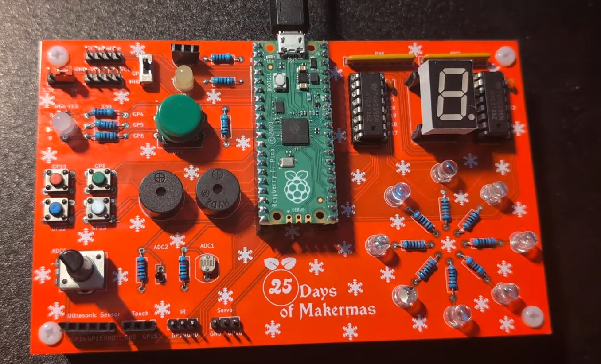
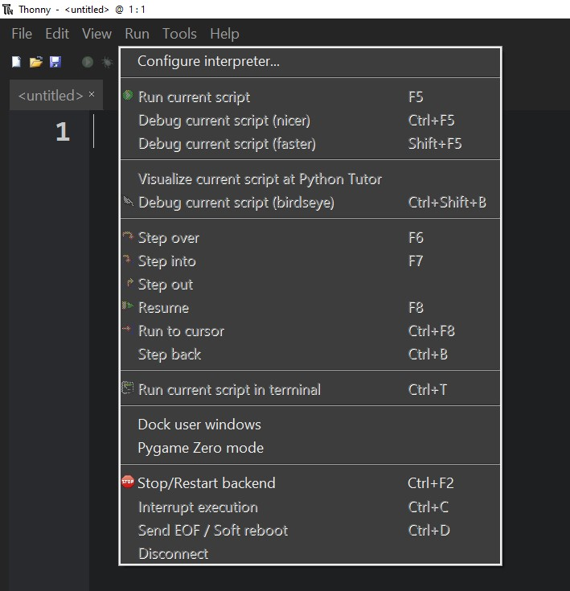
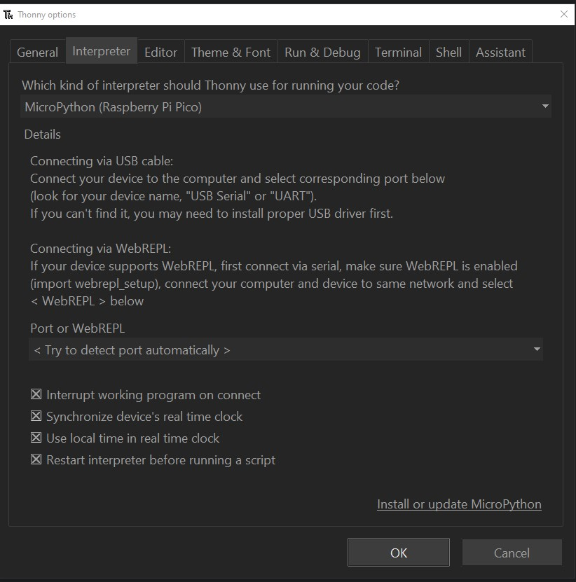
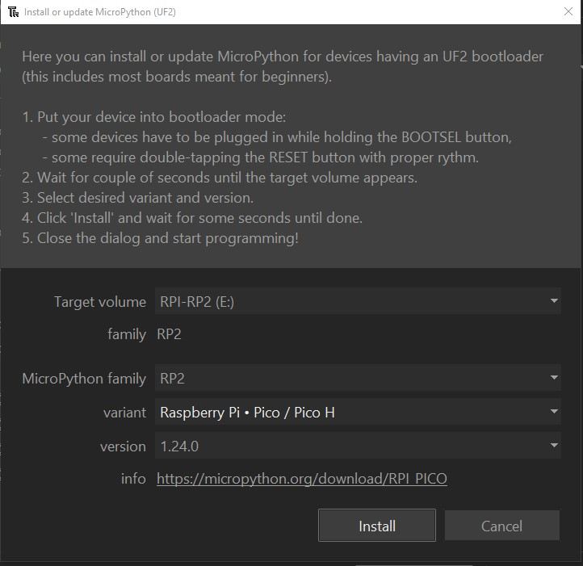
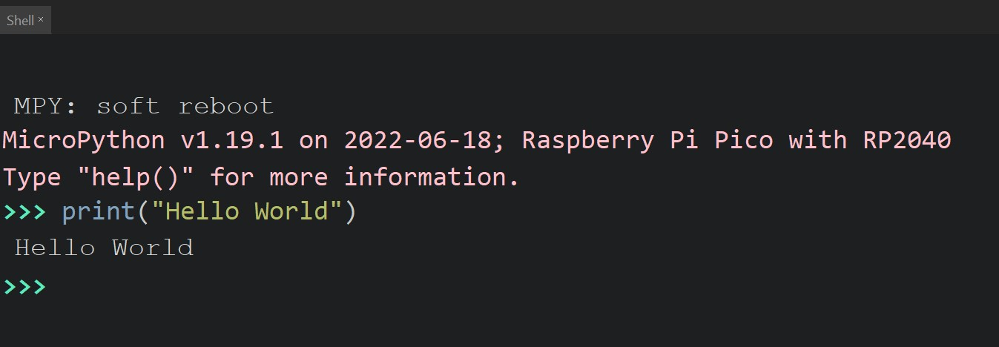
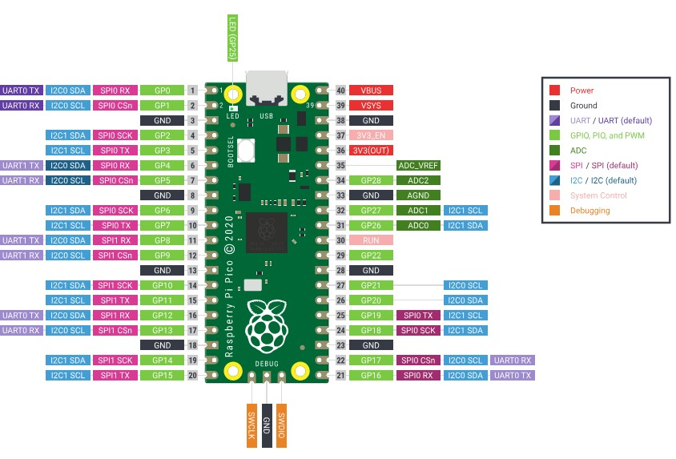

# Pico-Advent-Calendar

## Introduction
The 25 Days of Makermas is a Raspberry Pi Pico kit consiting of 25 projects that serve as an introduction to programming and controlling devices with a Raspberry Pi Pico.  

[Booklet WIP](https://docs.google.com/document/d/1rmNjlnt3vpmemfZ5pnnCj9qUnz_O2xRp1bQ-7SMrb30/edit?usp=sharing)     
  
 
## Parts Included:

| Item                           | Quantity | | Item                           | Quantity |
| ------------------------------ | -------- |-| ------------------------------ | -------- |
| Pi Pico                        | 1        | | Large Button                   | 3        |
| Makermas PCB                   | 1        | | Large Button Caps              | 3        |
| Wire M-F                       | 1        | | Slide Switch                   | 3        |
| Wire F-F                       | 1        | | Common Anode RGB LED           | 3        |
| Wire M-M                       | 1        | | White LED                      | 10       |
| 10k Potentiometer              | 2        | | Green LED                      | 10       |
| 180 Degree Servo Motor         | 1        | | HC-SR04 Ultrasonic Sensor      | 1        |
| 2.2K Resistors                 | 20       | | PIR Motion Sensor HC-SR501     | 1        |
| 10k Resistors                  | 4        | | TMP1075 I2C Module             | 1        |
| 10k Photoresistor              | 2        | | 1602 I2C LCD                   | 1        |
| 10k Thermistor                 | 2        | | Capacitive Touch Sensor Module | 1        |
| Common Anode 7-Segment Display | 2        | | 16 Pin IC Sockets              | 3        |
| 220 Ohm Resistor Array         | 4        | | 2 Pin Male Header              | 2        |
| SN74HC595 IC                   | 3        | | 2 Pin Jumper                   | 2        |
| 0.1uF Capacitor                | 4        | | 3 Pin Male Header              | 4        |
| Passive (Transducer) Buzzer    | 2        | | Popsicle Stick                 | 3        |
| Active (Indicator) Buzzer      | 2        | | Rubber Band                    | 3        |
| Small Button                   | 10       | | Micro USB Cable                | 1        |
| 3 Pin Female Header            | 2        | | 4 Pin Male Header              | 3        |
| 4 Pin Female Header            | 3        | | 5 Pin Female Header            | 3        |
| 20 Pin Female Header           | 3        | | 5 Pin Female Header            | 5        |
| Nylon Standoffs M3 x 20MM      | 5        |

## Table of Contents
- [Day 1](#day1)
- [Day 2](#day2)
- [Day 3](#day3)
- [Day 4](#day4)
- [Day 5](#day5)
- [Day 6](#day6)
- [Day 7](#day7)
- [Day 8](#day8)
- [Day 9](#day9)
- [Day 10](#day10)
- [Day 11](#day11)
- [Day 12](#day12)
- [Day 13](#day13)
- [Day 14](#day14)
- [Day 15](#day15)
- [Day 16](#day16)
- [Day 17](#day17)
- [Day 18](#day18)
- [Day 19](#day19)
- [Day 20](#day20)
- [Day 21](#day21)
- [Day 22](#day22)
- [Day 23](#day23)
- [Day 24](#day24)
- [Day 25](#day25)

## Day 1: Setup 
1. [Thonny IDE](#day1_thonny)
   1. Install Thonny
   2. Download Pi Pico Firmware
   3. Run Test Program
2. [The Pi Pico Pinout](#day1_pinout)
   1. Pinout
   2. Identify GPIO pin for LED
3. [Controlling the onboard LED](#day1_demo)
  
### Thonny IDE 
Go to the [Thonny](https://thonny.org/) website and download the free IDE. Thonny was chosen because it has features that make it easier to program with the pico and installing the firmware.

After opening Thonny, go to _Run_ -> _Configure Interpreter_                                                                       
From the Interpreter Menu Select _MicroPython (Raspberry Pi Pico)_ and click on __Install or update MicroPython__                   
Copy the following settings to install the Pi Pico Firmware. _If you have a different Pico model, choose the proper variant._      

The Pico should be ready to go.  

We can now use the shell and write the hardest line of code ever.     

### Pico Pinout  
Microcontrollers have multiple pins that have multiple functions on each. Most pins are general purpose input outpute (GPIO) pins that can be configure to output signals/data or input (recieve) signals/data. The other pins are power pins or serve special functions.
 - The power pins are VBUS (5V from the USB), 3V3 (3.3V), and GND. The other pins are power input or other functons.

Many of the GPIO pins have multiple functions that can only be used on that pin. For example Pin 32 has GP27, ADC1, and I2C1 SDA for its functions. Programmers can choose which function they want to use on each pin. How you use each pin will vary on what pin functions you need.
- For example if you need a lot of ADC functions, it may be better to use another pin's I2C function and dedicate Pin 32 to ADC.

The image below shows all the pins on the pico with their respective features.      

### Controlling the onboard LED 
Day1.py toggles the onboard LED and you can vary the speed at which the LED blinks. If you make the time fast enough the LED will appear constantly illuminated and you cannot see it turning off.

  

## Day 2: Soldering 
Day 2 introduces the main PCB and the header pins, and LED Checker/ Status Light are soldered in.

  

## Day 3: Controlling an External LED 
Day 3 invovles controlling an LED with the GPIO pins and explaining GPIO pins in a little more detail in addition to the various methods to control the LED.

  

## Day 4: Reading Inputs From a Button 
Day 4 continues the basics of GPIO inputs covering digital logic levels and reading inputs from a push button.

  

## Day 5: Slide Switch 
Day 5 introduces slide switches and using internal pull-up/down resistors.

  

## Day 6: Active Buzzer 
Day 6 introduces buzzers and how they create sound.

  

## Day 7: Capacitive Touch Sensor 
Day 7 introduces capacitive touch sensors and uses them to create a tapping game. Interrupts are introduced here.

  

## Day 8: RGB LED 
Day 8 introduces RGB LEDs and LED configurations like common anode. The first class is created here.

  

## Day 9: Button Matrix 
Day 9 sees the creation of a class to handle reading the inputs of 4 buttons.

  

## Day 10: Simon Says 
Day 10 is the first big system lesson that has the button matrix, RGB LED, and buzzer used to create a game of simon says!

  

## Day 11: Analog Inputs With a Potentiometer 
Day 11 introduces analog inputs and reading them with the ADC on the pico. A potentiometer is measured as an example.

  

## Day 12: PWM 
Day 12 introduces PWM and how to creates an effective analog voltage for us to control devices like an LED.

  

## Day 13: Rainbow RGB LED 
Day 13 sees PWM used with the RGB LED to create various colors and sweep through the visible color spectrum.

  

## Day 14: Servo Motor 
Day 14 utilizes PWM to control a servo motor and walks through the process of creating the code needed to control PWM devices.

  

## Day 15: Passive Buzzer 
Day 15 sees the user creating a music by using PWM to produce different pitched notes.

  

## Day 16: PIR Motion Sensor 
Day 16 introduces a PIR motion sensor and uses it to detect motion nearby.

  

## Day 17: Ultrasonic Sensor 
Day 17 introduces the ultrasonic distance sensor.

  

## Day 18: Proimity Gate 
Day 18 allows the user to create an arm gate that opens when the ultrasonic sensor and or motion sensor detect someone approaching it. Day 18 comes with a popsicle stick and rubber band to create the "arm".

  

## Day 19: Photoresistor 
Day 19 introduces the photoresistor and how to estimate the amount of light to control other devices.

  

## Day 20: Thermistor 
Day 20 introduces the thermistor and how to measure the ambient temperature.

  

## Day 21: Snowflake Display 
Day 21 introduces the 74HC595 shift register to control multiple LEDs (snowflake display) with less pins. 

  

## Day 22: 7-Segment Display 
Day 22 has the user daisy chain shift registers to control multiple LED displays. The LED display for ths lesson is a 7-segment display.

  

## Day 23: TMP1075 
Day 23 introduces I2C devices and uses the TMP1075 to measure temperature.

  

## Day 24: 1602 LCD 
Day 24 introduces the 1602 LCD and using multiple I2C devices on the same bus.

  

## Day 25: Spread Holiday Cheer 
On Day 25 you must express your holiday cheer. How you do so is left to you. You have plenty of tools. Good luck!  
To give you a place to start. One idea is to have a light show with the snowflake display while Christmas music plays on the buzzer (you can also control both buzzers).

  
#Thanks
This project is ongoing and will likely continue to change. Thanks for checking it out.
